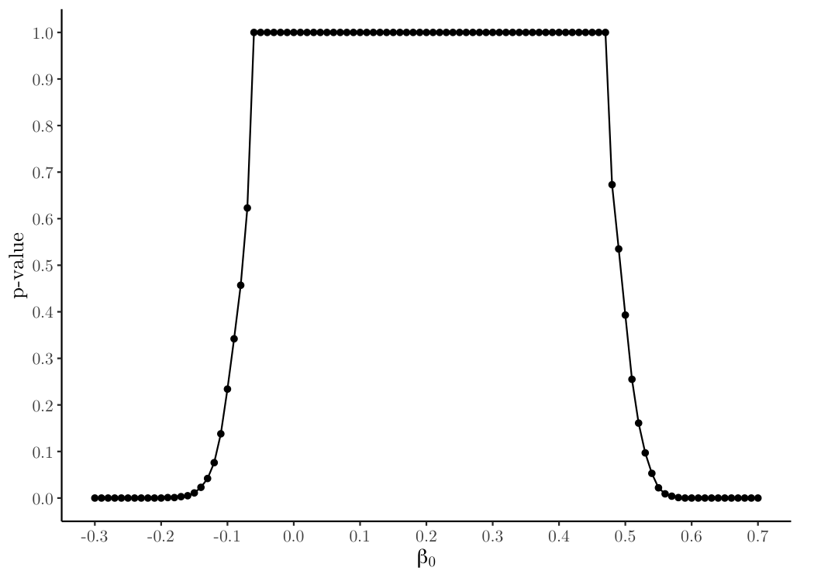

<!-- README.md is generated from README.Rmd. Please edit that file -->

=========================================================

<!-- badges: start -->


<!-- badges: end -->

## Installation

The `shapeinf` package is hosted on GitHub at
<https://github.com/ian-xu-economics/shapeinf/>. It can be installed
using the remotes::install_github() function:

``` r
# install.packages("remotes")
remotes::install_github("ian-xu-economics/shapeinf)
```

## Using `shapeinf`

After installing `shapeinf`, we can attach the package to our session
using the base `library()` function. We’ll need `ivprte` and `tidyverse`
for this documentation as well.

``` r
library(shapeinf)
library(ivprte)
library(tidyverse)
```

## Example Usage

Suppose we have the following data generating process (DGP):

- No covariates
- $Z_i \in \{0, 1\}$ is binary with equal probability,
- $p(z) \equiv \mathbb{P}[D_i = 1 | Z_i = z]$,
- $p(0) = 0.3$,
- $p(1) = 0.7$,
- The true marginal treatment responses (MTRs) are linear and specified
  in the Bernstein basis:
- $Y_i \equiv \mathbf{1}[U_i \leq p(z)]$

We’ll first code up this DGP into R.

``` r
basis0 = bernstein_basis(1)
coefficients0 = c(0.5, 0.4)
mtr0 = MTR(basis0, coefficients0)

basis1 = bernstein_basis(1)
coefficients1 = c(0.8, 0.4)
mtr1 = MTR(basis1, coefficients1)

dgp.in <- dgp(suppZ = c(0,1), 
              densZ = c(0.5, 0.5),
              pscoreZ = c(0.3, 0.7),
              mtrs = list(mtr0, mtr1))
```

Now that we have the DGP coded into R, we’ll draw 10,000 observations.
Generally, the data must contain the following columns:

- `y`, a binary outcome variable;
- `d`, a binary variable indicating treatment status; and
- `z`, a binary variable indicating instrument status.

``` r
sample.size <- 10000

data <- simulate_data(dgp.in, sample.size)

head(data)
#> # A tibble: 6 × 3
#>       y     d     z
#>   <dbl> <dbl> <dbl>
#> 1     0     0     1
#> 2     0     1     1
#> 3     0     0     0
#> 4     0     0     0
#> 5     1     0     0
#> 6     0     0     0
```

## Compute First Order Conditions and Declare MTRS

``` r
bases.in <- list(ivprte::bernstein_basis(6),
                 ivprte::bernstein_basis(6))

assumptions.extra = list(lhs = expectBBPrime(dgp.in, bases.in),
                         rhs = expectBY(dgp.in, bases.in),
                         dir = rep("=", 14))
```

# Population Values for the ATT

## Compute True ATT and Population Bounds

``` r
ivprte::compute_population_value(target.parameter = "ATT", 
                                 dgp = dgp.in)
#>   ATT 
#> 0.213

ivprte::compute_population_bounds(target.parameter = "ATT",
                                  dgp = dgp.in,
                                  bases = bases.in,
                                  assumptions = "extra",
                                  assumptions.extra = assumptions.extra)
#>     lower.bound upper.bound
#> ATT -0.05843955   0.4746045
```

Suppose our target parameter of interest is the average treatment on the
treated (ATT). The true ATT is 0.213. The population bounds with the
marginal treatment responses (MTRs) specified as sextic Bernstein
polynomials are \[-0.058, 0.475\].

# Compute the Confidence Interval Using Zhu’s Shape-Restricted Test

We can test null values of the target parameter $\beta_0$ using the
shape-restricted test defined in Zhu (2020) by using the function
`shapeinf`. A $(1-\alpha) \times 100\%$ confidence interval can be
created by test-inversion.

We can compute a $(1-\alpha) \times 100\%$ confidence interval using
`shapeinf`:

``` r
shapeinf.example <- shapeinf(data,
                             target.parameter = "ATT",
                             alpha = 0.1,
                             bases = bases.in,
                             beta.null = seq(-0.3, 0.7, 0.01),
                             number.bootstraps = 500,
                             bootstrap.seeds = 1:500,
                             parallel = TRUE,
                             return.gurobi = TRUE)
#> ℹ Computing test statistics...
#> ℹ Computing bootstrap test statistics...
#> ℹ Computing the confidence interval through test inversion...
```

``` r
shapeinf.example
#> 
#> Zhu Shape-Restricted Test
#> 
#> Call:shapeinf(data = data, target.parameter = "ATT", alpha = 0.1, 
#>     bases = bases.in, beta.null = seq(-0.3, 0.7, 0.01), number.bootstraps = 500, 
#>     bootstrap.seeds = 1:500, parallel = TRUE, return.gurobi = TRUE)
#> 
#> Target Parameter: Average Treatment on the Treated (ATT)
#> 
#> 90% Confidence Interval: (-0.1161, 0.5295)
```

Two items should be of note regarding the confidence intervals outputted
by `shapeinf`:

1.  To tighten the bounds of the confidence intervals, linear
    interpolation is used. Suppose we our level of significance
    $\alpha = 0.1$. We test $\beta_0 = 1$ and $\beta_0 = 1.1$ using
    `shapeinf` and the respective p-values are $0.12$ and $0.08$
    respectively. We can draw a line between these two points, and
    estimate that the upper bound is $1.05$ because the estimated
    $p$-value at this $\beta_0$ is $0.1$.

2.  For some data generating processes, the $p$-value function can be
    multimodal; the $p$-value can increase as $\beta_0$ deviates further
    from the truth. Therefore, it is imperative to test a broad range of
    $\beta_0$ values. In these cases, the outputted confidence interval
    will be conservative as it will include values for which the Zhu’s
    test rejected.

## Supported Target Parameters

We can compute the true, population bounds, and confidence intervals for
the following target parameters:

- Average untreated outcome (“AUO”)
- Average treated outcome (“ATO”)
- Average treatment effect (“ATE”)
- Average treatment on the treated (“ATT”)
- Average treatment on the untreated (“ATU”)
- Local average treatment effect (“LATE”)

To do this, simply change the target parameter. If the target.parameter
is “LATE”, we’ll also need to input the lower and upper bounds into
`late.lb` and `late.ub` parameters respectively.

## Changing Alpha

If we want to change our level of significance $\alpha$ after running
`shapeinf()` and compute a new $1-\alpha$ confidence interval, we can
use the `summary()` function and set the `alpha` parameter to a new
value:

``` r
summary(shapeinf.example,
        alpha = 0.05)
#> 
#> Zhu Shape-Restricted Test
#> 
#> Call:shapeinf(data = data, target.parameter = "ATT", alpha = 0.05, 
#>     bases = bases.in, beta.null = seq(-0.3, 0.7, 0.01), number.bootstraps = 500, 
#>     bootstrap.seeds = 1:500, parallel = TRUE, return.gurobi = TRUE)
#> 
#> Target Parameter: Average Treatment on the Treated (ATT)
#> 
#> 95% Confidence Interval: (-0.1276, 0.541)
```

## Detailed Information

Sometimes, researchers like seeing the $p$-value curve. This $p$-value
for each $\beta_0$ value is stored in `shapeinf` object.

``` r
head(shapeinf.example$beta.null.test.detailed)
#> # A tibble: 6 × 4
#>   beta.null test.stat gurobi.result     p.value
#>       <dbl>     <dbl> <list>              <dbl>
#> 1     -0.3   1126969. <named list [12]>       0
#> 2     -0.29   941090. <named list [12]>       0
#> 3     -0.28   790956. <named list [12]>       0
#> 4     -0.27   676567. <named list [12]>       0
#> 5     -0.26   597249. <named list [12]>       0
#> 6     -0.25   531816. <named list [12]>       0
```

We can plot a the $p$-value curve using `ggplot2::ggplot()`:

``` r
ggplot(shapeinf.example$beta.null.test.detailed, 
       aes(x = beta.null, y = p.value)) + 
  geom_line() + 
  geom_point() + 
  scale_x_continuous(name = latex2exp::TeX("$\\beta_0$"),
                     n.breaks = 10) + 
  scale_y_continuous(name = "p-value",
                     n.breaks = 10) + 
  theme(panel.grid = element_blank(),
        text = element_text(family = "LM Roman 10", size = 13),
        panel.background = element_rect(fill = "transparent", color = NA),
        axis.line = element_line(color = "black"),
        plot.margin = unit(c(0.2, 0.5, 0.2, 0.2), "cm"))
```



Some additional detailed data that may be of interest are the test
statistics and bootstrap test statistics. The test statistics are stored
in `beta.null.test.detailed` (where the $\beta_0$ and $p$-values are
also stored). The bootstrap test statistics are stored in
`bootstrap.detailed`.

``` r
head(shapeinf.example$bootstrap.detailed)
#> # A tibble: 6 × 7
#>   bootstrap.number bootstrap.seed beta.null gamma lambda bootstrap.test.stat
#>              <int>          <int>     <dbl> <dbl>  <dbl>               <dbl>
#> 1                1              1     -0.3  0.330     0              108172.
#> 2                1              1     -0.3  0      1086.              51156.
#> 3                1              1     -0.29 0.330     0               91352.
#> 4                1              1     -0.29 0      1086.              49792.
#> 5                1              1     -0.28 0.330     0               77337.
#> 6                1              1     -0.28 0      1086.              48494.
#> # ℹ 1 more variable: gurobi.result <list>
```

If the user wants to see the results from `gurobi::gurobi()`, they can
set the `return.gurobi` parameter to `TRUE` when running `shapeinf()`.
The detailed `gurobi()` results for each test statistic and bootstrap
test statistic are stored as a column in `beta.null.test.detailed` and
`bootstrap.detailed`.

## Using Population $\tau$

One can also include the DGP into `shapeinf()`. If the DGP is included,
`shapeinf()` will automatically compute the population $\tau$—rather
than the estimated $\tau$—and use that to compute the test statistics
and bootstrap test statistics.

``` r
shapeinf.example.dgp <- shapeinf(data,
                                 target.parameter = "ATT",
                                 alpha = 0.1,
                                 bases = bases.in,
                                 beta.null = seq(-0.3, 0.7, 0.01),
                                 number.bootstraps = 500,
                                 bootstrap.seeds = 1:500,
                                 parallel = TRUE,
                                 return.gurobi = TRUE,
                                 dgp.in = dgp.in)
#> ℹ Computing test statistics...
#> ℹ Computing bootstrap test statistics...
#> ℹ Computing the confidence interval through test inversion...

data.frame(estimated.tau = shapeinf.example$tau,
           population.tau = shapeinf.example.dgp$tau)
#>    estimated.tau population.tau
#> 1    -0.27132669    -0.27391814
#> 2    -0.23713776    -0.23811314
#> 3    -0.18921028    -0.18916214
#> 4    -0.14335597    -0.14285714
#> 5    -0.09767616    -0.09655214
#> 6    -0.04891361    -0.04760114
#> 7    -0.01237952    -0.01179614
#> 8     0.27132669     0.27391814
#> 9     0.23713776     0.23811314
#> 10    0.18921028     0.18916214
#> 11    0.14335597     0.14285714
#> 12    0.09767616     0.09655214
#> 13    0.04891361     0.04760114
#> 14    0.01237952     0.01179614
```
